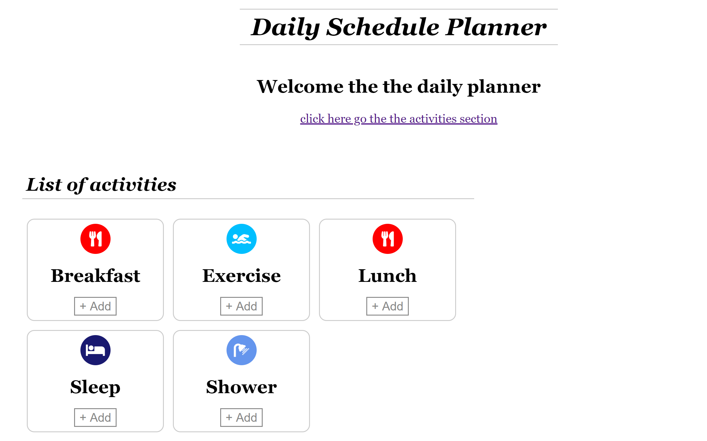

# Angular Lifecycle

[Live code](https://stackblitz.com/edit/s2-routing-lazy-loading) to follow along from the section.

Every component has a lifecycle managed by Angular. We have access to key moments with predefined methods such as ngOnChanges\(\) or ngOnInit\(\). For more information, visit the official website

[https://angular.io/guide/lifecycle-hooks](https://angular.io/guide/lifecycle-hooks)


The first thing that runs is the constructor, before any lifecycle hooks such as ngOnInit\(\) are executed. We will cover constructors in the next section


In this section, we are going to use ngOnInit\(\) to set the list of activities on initial load of the component.

Generate the list-activities components

```bash
ng generate component activities/list-activities
```

In list-activities.component.ts add the following code

**...\daily-planner\src\app\activities\list-activities\list-activities.component.ts**

```typescript
import { Component, OnInit } from '@angular/core';
import { ActivityModel } from '../../data/activity.model';
import { ActivitiesConst } from '../../data/activities';

@Component({
  selector: 'app-list-activities',
  templateUrl: './list-activities.component.html',
  styleUrls: ['./list-activities.component.css']
})
export class ListActivitiesComponent implements OnInit {
  activitiesList: ActivityModel[];

  constructor() { }

  ngOnInit() {
    this.activitiesList = ActivitiesConst;
  }
}
```

In list-activities.component.html add the following code

**...\daily-planner\src\app\activities\list-activities\list-activities.component.html**

```markup
<section id="activity-list">
  <h1> List of activities</h1>
  <article class="activity-item" *ngFor="let activity of activitiesList">
    <i class="fas {{activity.image}} circle-icon"></i>
    <h2>{{activity.name}}</h2>
    <button class="btn-add">+ Add</button>
  </article>
</section>
```

Now add the &lt;app-list-activities&gt; selector to the activities.component.html

**...\daily-planner\src\app\activities\activities.component.html**

```markup
<app-list-activities></app-list-activities>
```


Congratulations! Now you should see a list of activities on your simple app.




Completed [live code](https://stackblitz.com/edit/s3-lifecycle-hooks) for this section.

