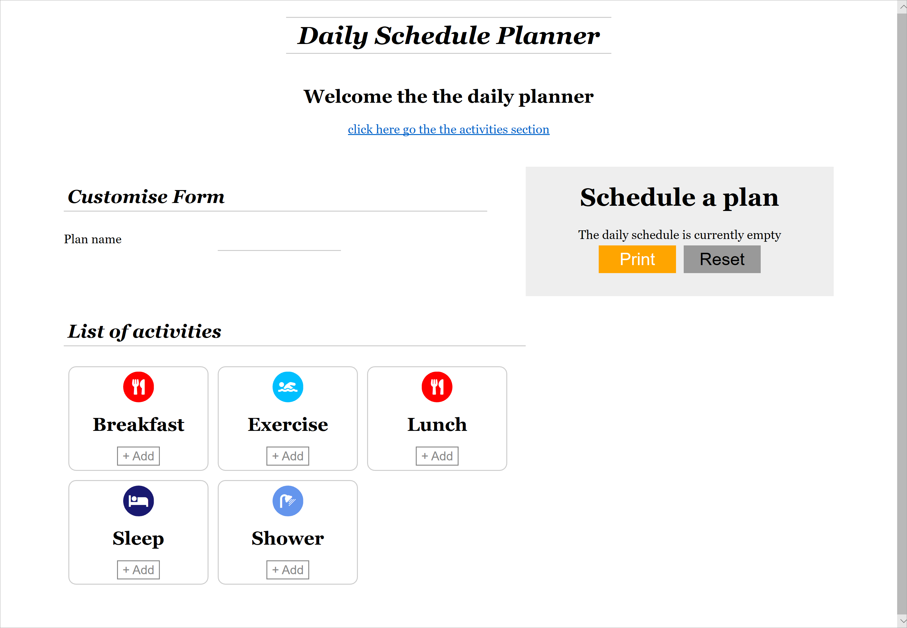

# Angular Reactive Forms

[Live code](https://stackblitz.com/edit/s6b-reset-plan-update-activities-list) to follow along from this section.

> Reactive forms provide a model-driven approach to handling form inputs whose values change over time. [https://angular.io/guide/reactive-forms](https://angular.io/guide/reactive-forms)
>
> They are built on observable base APIs \(async data flow\) to read continuous streams of values inputted to the form. It enables more customisation on complex forms and can use dynamically created inputs at run time. Reactive Forms also work well with unit testing.


Angular also offers Template Driven forms as an alternative but it is considered best practice to use Reactive Forms.


Create a new customise-form component

```bash
ng g c activities/customise-form  --skipTests
```

Import FormModules and ReactiveFormsModule into the activities.modules.ts file

**...\daily-planner\src\app\activities\activities.module.ts**

```typescript
import { FormsModule, ReactiveFormsModule } from '@angular/forms';

imports: [
    CommonModule,
    ActivitiesRoutingModule,
    FormsModule,
    ReactiveFormsModule,
  ]
```

**...\daily-planner\src\app\activities\customise-form\customise-form.component.ts**

In the customise-form.component.ts page, add a modelForm variable with the type formGroup. Then inject formBuilder - making sure to import it from the @angular/forms node-module

Finally, in the customise-form.component.ts file, set the formGroup with the formControlName as per below

```typescript
import { Component, OnInit } from '@angular/core';
import { FormGroup, FormBuilder } from '@angular/forms';

@Component({
  selector: 'app-customise-form',
  templateUrl: './customise-form.component.html',
  styleUrls: ['./customise-form.component.css']
})
export class CustomiseFormComponent implements OnInit {
  modelForm: FormGroup;

  constructor(private fb: FormBuilder) {
    this.modelForm = this.fb.group({
      name: ''
    });
  }

  ngOnInit() {
  }

}
```

Add the code to the customise-form.component.html file

**...\daily-planner\src\app\activities\customise-form\customise-form.component.html**

```markup
<section id="customise">
  <h1>Customise Form</h1>
  <form [formGroup]="modelForm">
    <p>
      <label>Plan name</label>
      <input type="text" formControlName="name">
    </p>
  </form>
</section>
```

Add the selector app-customise-form to activities.component.html

**...\daily-planner\src\app\activities\activities.component.html**

```markup
<app-view-plan (updateActivitiesList)="updateActivities($event)" (reloadActivities)="reload()"></app-view-plan>
<app-customise-form></app-customise-form>
<app-list-activities [activitiesList]="activities" (addItemPlan)="addToPlan($event)"></app-list-activities>
```



## Code Changed

Changes in **activities.component.html**
 **Figure: Final activities.component.html code**

Changes in **activities.module.ts**
 **Figure: Final activities.module.ts code**

Changes in **customise-form.component.ts**
 **Figure: Final customise-form.component.ts code**

Changes in **customise-form.component.html**
 **Figure: Final customise-form.component.html code**


Completed [live code](https://stackblitz.com/edit/s7-reactive-forms) for this section.

