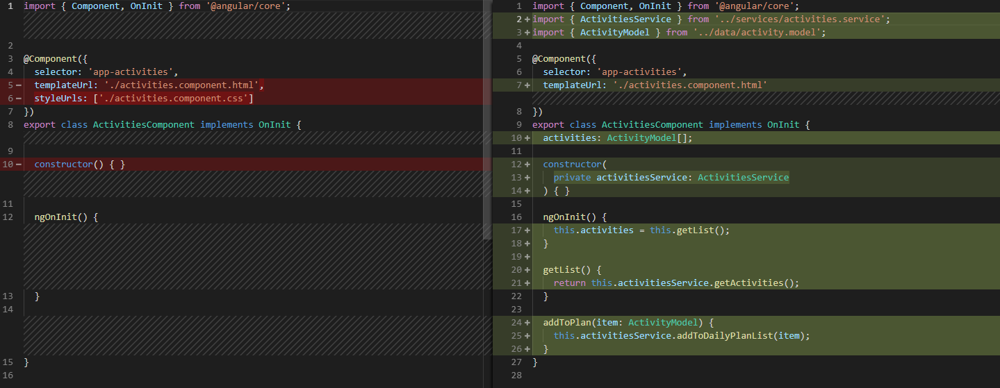

# Inputs, Outputs and EventEmitters

[Live code](https://stackblitz.com/edit/s4-dependency-injection) to follow along for this section.

To communicate between parent and child components, Angular offers @Inputs\(\) and @Outputs\(\) decorators with the EventEmitter class.


It is generally a good idea for the parent component be responsible for making service calls and only sending a child component what it needs to do their job. In this section, we will move the service call to the Parent Activities component and the list to the List-activities component for display and when the add button is clicked we will end that information back to the parent


## Parent Component

Move the code that calls the service from the child activities.list component to the parent activities component as listed below.

**...\daily-planner\src\app\activities\activities.component.ts**

```typescript
import { Component, OnInit } from '@angular/core';
import { ActivitiesService } from '../services/activities.service';
import { ActivityModel } from '../data/activity.model';

@Component({
  selector: 'app-activities',
  templateUrl: './activities.component.html'
})
export class ActivitiesComponent implements OnInit {
  activities: ActivityModel[];

  constructor(
    private activitiesService: ActivitiesService
  ) { }

  ngOnInit() {
    this.activities = this.getList();
  }

  getList() {
    return this.activitiesService.getActivities();
  }
}
```

## Input decorator

Now that we have the activities variable in parent \(activities.component.ts\) we are going to send the data to the child component \(list-components.ts\) as an Input

In the activities.component.html file, assign the local activities to the child property activitiesList

**...\daily-planner\src\app\activities\activities.component.html**

```markup
<app-list-activities [activitiesList]="activities"></app-list-activities>
```

To listen to the variable, we import Input add an @Input decorator in the list-activities.component.ts file

**...\daily-planner\src\app\activities\list-activities\list-activities.component.ts**


Only add to the import type you need to the @angular/core statement and not the whole line


```typescript
import { Component, OnInit, Input } from '@angular/core';
```

just inside the export class add @Input\(\) to the beginning of the activitiesList array

```typescript
@Input() activitiesList: ActivityModel[];
```

Remove the any references to ActivitiesService that we added previously as it is no longer needed at this level \(list-component.ts\) - serve the application and check the list is displaying as expected.

**...\daily-planner\src\app\activities\list-activities\list-activities.component.ts**

```typescript
import { Component, OnInit, Input } from '@angular/core';
import { ActivityModel } from '../../data/activity.model';


@Component({
  selector: 'app-list-activities',
  templateUrl: './list-activities.component.html',
  styleUrls: ['./list-activities.component.css']
})
export class ListActivitiesComponent implements OnInit {
  @Input() activitiesList: ActivityModel[];

  constructor() { }

  ngOnInit() {
  }
}
```

## Output Decorator

Back in the list-activities.component.html file add a click event listener to the add button

**...\daily-planner\src\app\activities\list-activities\list-activities.component.html**

```markup
<button class="btn-add" (click)="addToDailyPlan(activity)">+ Add</button>
```

In the list-activities.component.ts file add the following code - this is an emitter and will emit the selected item back to the parent page

**...\daily-planner\src\app\activities\list-activities\list-activities.component.ts**

```typescript
import { Component, OnInit, Input, Output, EventEmitter } from '@angular/core';
```

```typescript
@Output() addItemPlan: EventEmitter<ActivityModel> = new EventEmitter<ActivityModel>();
```

Add a new function addToDailyPlan\(activity\) under the ngOnInit\(\) function in the list-activities.component.ts page

```typescript
addToDailyPlan(activity: ActivityModel) {
    this.addItemPlan.emit(activity);
}
```

In the activities.component.html file add \(addItemPlan\)="addToPlan\($event\)" to indicate that we are sending the event out of the child component.

**...\daily-planner\src\app\activities\activities.component.html**

```markup
<app-list-activities [activitiesList]="activities" (addItemPlan)="addToPlan($event)"></app-list-activities>
```

**.../src/app/activities/activities.component.ts**

In the activities.component.ts file create a function to call the function just created

```typescript
addToPlan(item: ActivityModel) {
    this.activitiesService.addToDailyPlanList(item);
}
```

Open the file src/app/services/activities.service.ts and add a dailyPlanList array with type ActivityModel\[\] and create an addToDailyPlanList function that will push the item into the dailyPlanList array

**...\daily-planner\src\app\services\activities.service.ts**

```typescript
dailyPlanList: ActivityModel[] = [];
```

```typescript
public addToDailyPlanList(item: ActivityModel) {
    this.dailyPlanList.push(item);
}
```

## Code Changed

Changes in **activities.component.html**


Changes in **activities.component.ts** 



Changes in **list-activities.component.html**


Changes in **list-activities.component.ts**


Changes in **activities-service.ts** 


Completed [live code](https://stackblitz.com/edit/s5-inputs-outputs-eventemitter) from this section.

