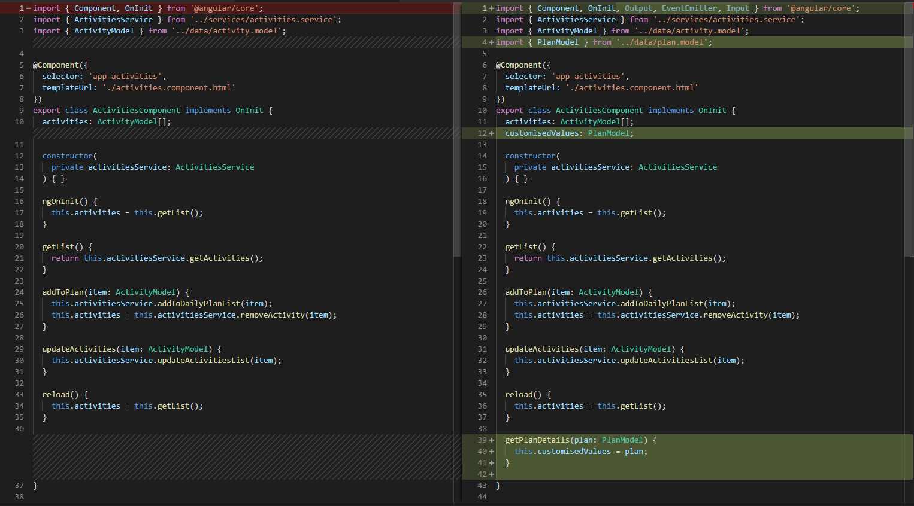
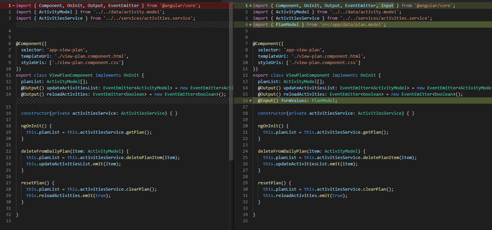

# Subscribe, Unsubscribe, OnDestroy

[Live code](https://stackblitz.com/edit/s7-reactive-forms) to follow along from this section.

> Observable is a way of managing streams of multiple values or data. It is not specific to Angular but is widely used across all modern frameworks. There are many operators to handle observables found here [https://rxjs-dev.firebaseapp.com/api](https://rxjs-dev.firebaseapp.com/api). Angular uses RxJs to provide observables.
>
> [https://angular.io/guide/observables-in-angular](https://angular.io/guide/observables-in-angular)

Subscribe is a method on an observable that we will be using in this section to 'subscribe' to any changes on the form.

**...\daily-planner\src\app\activities\customise-form\customise-form.component.ts**

In ngOnInit\(\) subscribe to the form changes

```typescript
ngOnInit() {
    this.modelForm.valueChanges.subscribe(val => {
      this.customiseFormChanges.emit(val);
    });
  }
```

Add an Output and EventEmitter to the existing import statement to emit any changes from the form \(customise-form.component.ts\) back to the parent \(activities.component.ts\)

```typescript
import { Component, OnInit, Output, EventEmitter } from '@angular/core';

import { PlanModel } from '../../data/plan.model';
```

Add the output decorator to the customiseFormChanges property in customise-form.component.ts

```typescript
@Output() customiseFormChanges: EventEmitter<PlanModel> = new EventEmitter<PlanModel>();
```

**...\daily-planner\src\app\activities\activities.component.html**

```markup
<app-view-plan (updateActivitiesList)="updateActivities($event)" (reloadActivities)="reload()"></app-view-plan>
<app-customise-form 
(customiseFormChanges)="getPlanDetails($event)">
</app-customise-form>
<app-list-activities [activitiesList]="activities" (addItemPlan)="addToPlan($event)"></app-list-activities>
```

**...\daily-planner\src\app\activities\activities.component.ts**

```typescript
import { Component, OnInit, Output, EventEmitter, Input } from '@angular/core';
import { PlanModel } from '../data/plan.model';

customisedValues: PlanModel;
```

Create getPlanDetails\(\) passing in plan of type PlanModel

```typescript
getPlanDetails(plan: PlanModel) {
    this.customisedValues = plan;
}
```

## Send values to child component

Add \[formValues\]="customiseValues" to app-view-plan to pass values to child component

**...\daily-planner\src\app\activities\activities.component.html**

```markup
<app-view-plan 
    [formValues]="customisedValues" 
    (updateActivitiesList)="updateActivities($event)" 
    (reloadActivities)="reload()">
</app-view-plan>
<app-customise-form (customiseFormChanges)="getPlanDetails($event)"></app-customise-form>
<app-list-activities [activitiesList]="activities" (addItemPlan)="addToPlan($event)"></app-list-activities>
```

**...\daily-planner\src\app\activities\customise-form\view-plan.component.ts**

```typescript
import {
  Component, OnInit, Output, Input
} from '@angular/core';


@Input() formValues: PlanModel;
```

In the view-plan.components.html above the daily-schedule-list div class

**...\daily-planner\src\app\activities\view-plan\view-plan.component.html**

```markup
<div id="daily-schedule">
  <h1>Schedule a plan</h1>
  <div *ngIf="planList.length <= 0">
    The daily schedule is currently empty
  </div>
  <div *ngIf="formValues">
    <h2>{{ formValues.name }} plan</h2>
    <p>{{ formValues.selectedDate | date: 'MMMM d, y' }}</p>
  </div>
```

[https://angular.io/guide/pipes](https://angular.io/guide/pipes)


Congratulations! You should be able to see the form values inputted onto your form appear on the View plan area of the UI


## Unsubscribe\(\) and OnDestroy\(\)

When subscribing to an observable we need to unsubscribe to release the memory allocation otherwise we will experience memory leaks on our application.

```bash
npm install rxjs --save
npm install rxjs-compat --save
```

**...\daily-planner\src\app\activities\customise-form\customise-form.component.ts**

```typescript
import { Component, OnInit, Output, EventEmitter, OnDestroy } from '@angular/core';
import { Subscription } from 'rxjs/Subscription';
```

```typescript
private formSubscription: Subscription;
```

```typescript
export class CustomiseFormComponent implements OnInit, OnDestroy {
```

```typescript
ngOnInit() {
    this.formSubscription= this.modelForm.valueChanges.subscribe(val => {
      this.customiseFormChanges.emit(val);
    });
  }

ngOnDestroy() {
    this.formSubscription.unsubscribe();
}
```

## **Expected Outcome**


## Code Changed

Changes in **activities.component.html**


Changes in **activities.component.ts** 



Changes in **customise-form.component.ts** 


Changes in **view-plan.component.html**


Changes in **view-plan.component.ts** 



Completed [live code](https://stackblitz.com/edit/s8-subscribe-unsubscribe-ondestroy) for this section.

