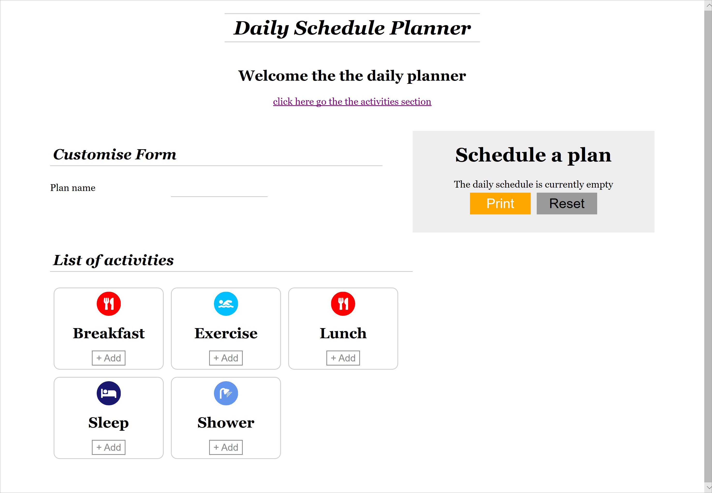

# Subscribe, Unsubscribe, OnDestroy

[Live code](https://stackblitz.com/edit/s7-reactive-forms) to follow along from this section.

> Observable is a way of managing streams of multiple values or data. It is not specific to Angular but a new standard included in the ES7 release. There are many operators to handle observables found here [https://rxjs-dev.firebaseapp.com/api](https://rxjs-dev.firebaseapp.com/api)
>
> [https://angular.io/guide/observables-in-angular](https://angular.io/guide/observables-in-angular)

Subscribe is a method on an observable type that we will be using in this section to 'subscribe' to any changes on the form.

**...\daily-planner\src\app\activities\customise-form\customise-form.component.ts**

In ngOnInit\(\) subscribe to the form changes

```typescript
ngOnInit() {
    this.modelForm.valueChanges.subscribe(val => {
      this.customiseFormChanges.emit(val);
    });
  }
```

Add Output and EventEmitter to the existing import statement to emit any changes from the form \(customise-form.component.ts\) back to the parent \(view-plan.component.ts\)

```typescript
import { Component, OnInit, Output, EventEmitter } from '@angular/core';
```

```typescript
@Output() customiseFormChanges: EventEmitter<any> = new EventEmitter<any>();
```

Add output parameters to the app-customise-form selector in activities.component.html

**...\daily-planner\src\app\activities\activities.component.html**

<!--
TODO: This part doesn't seem to be in the live code.
`<app-customise-form (customiseFormChanges)="getPlanDetails($event)"></app-customise-form>`

Also, in live code it's in activities.component.html

That one is correct, than bellow should be:
-->

```markup
<app-view-plan [formValues]="customisedValues" (updateActivitiesList)="updateActivities($event)" (reloadActivities)="reload()"></app-view-plan>
<app-customise-form (customiseFormChanges)="getPlanDetails($event)"></app-customise-form>
<app-list-activities [activitiesList]="activities" (addItemPlan)="addToPlan($event)"></app-list-activities>
```

Create getPlanDetails\(\) inside activities.component.ts

**...\daily-planner\src\app\activities\activities.component.ts**

```typescript
import { Component, OnInit, Output, EventEmitter, Input } from '@angular/core';
import { PlanModel } from '../../data/plan.model';

customisedValues: PlanModel;
```

Create getPlanDetails\(\) passing in plan of type PlanModel

```typescript
getPlanDetails(plan: PlanModel) {
    this.customisedValues = plan;
}
```

**...\daily-planner\src\app\activities\customise-form\customise-form.component.ts**

```typescript
@Input() formValues: PlanModel;
```

add \[formValues\]="customiseValues" to app-view-plan to pass values to child component

**...\daily-planner\src\app\activities\activities.component.html**

```markup
<app-view-plan [formValues]="customisedValues" (updateActivitiesList)="updateActivities($event)" (reloadActivities)="reload()"></app-view-plan>
```

In the view-plan.components.html above the daily-schedule-list div class

**...\daily-planner\src\app\activities\view-plan\view-plan.component.html**

```markup
<div id="daily-schedule">
  <h1>Schedule a plan</h1>
  <div *ngIf="planList.length <= 0">
    The daily schedule is currently empty
  </div>
  <div *ngIf="formValues">
    <h2>{{ formValues.name }} plan</h2>
    <p>{{ formValues.selectedDate | date: 'MMMM d, y' }}</p>
  </div>
```

[https://angular.io/guide/pipes](https://angular.io/guide/pipes)


Congratulations! You should be able to see the form values inputted onto your form appear on the View plan area of the UI


## Unsubscribe\(\) and OnDestroy\(\)

When subscribing to an observable we need to unsubscribe to release the memory allocation otherwise we will experience memory leaks on our application.

```bash
npm install rxjs --save
npm install rxjs-compat --save
```

<!--
TODO: When checking the live code, the following code is down below.
-->
**...\daily-planner\src\app\activities\customise-form\customise-form.component.ts**

```typescript
import { Component, OnInit, Output, EventEmitter, OnDestroy } from '@angular/core';
import { Subscription } from 'rxjs/Subscription';
```

```typescript
private formSubscription: Subscription;
```

```typescript
export class CustomiseFormComponent implements OnInit, OnDestroy {
```

```typescript
ngOnInit() {
    this.formSubscription= this.modelForm.valueChanges.subscribe(val => {
      this.customiseFormChanges.emit(val);
    });
  }

ngOnDestroy() {
    this.formSubscription.unsubscribe();
}
```



Completed [live code](https://stackblitz.com/edit/s8-subscribe-unsubscribe-ondestroy) for this section.

